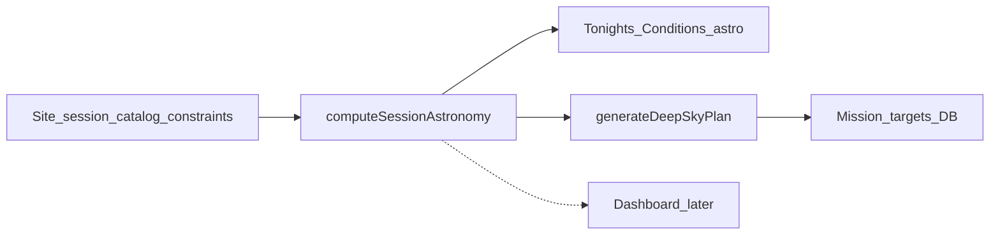

# Astronomy & Deep-Sky Visibility Plan

**Status:** Implemented — Create Mission astronomy + deep-sky Generate Plan. Dashboard reuse deferred.  
**Context:** Phase D.1 done — Supabase SoT for Setup+ missions; Auth → mission → Save Log → Sessions must keep working. `astronomy-engine` ^2.1.19 already used in `src/lib/sky/skyMath.ts` (`Horizon`/`Observer` only). Create Mission previously called `generateMockPlan`.

**Locked defaults:**
- Dark window = **astronomical twilight** (Sun altitude −18°) per Astronomy Engine `SearchAltitude` docs.
- `moonTolerance` = **hard exclude** when min Moon–target separation during candidate window < tolerance; survivors get a real `moonSeparationScore`.
- `sessionEndTime` stays **UI-only** this milestone (no schema change); both start and end feed calculations.
- `datetime-local` parsed as **browser-local** `Date` (current wizard); site timezone column deferred.
- Observer height = **0 m** (no elevation on locations).
- Planetary Generate Plan stays **demo-labeled mock**; deep-sky path becomes calculated.

**Out of scope:** Open-Meteo, 7Timer, AI, OpenNGC import, planetary ephemeris planning, Electron, visual redesign. Preserve uncommitted work.

---

## 1. Value map: calculated vs stored vs mocked

### Already calculated (client, not stored)
- Live Sky star/target **Alt/Az** via `altAzFromRaDec` (`src/lib/sky/skyMath.ts`) + `useSkyModel`.

### Stored (mission / session — not recomputed)
- Mission `dateTime`, constraints (`minAltitude`, `moonTolerance`, …), `mission_targets.planned_window_*`, `score`, optional sub-scores — from plan generation then DB (`persistMission`).
- Location `lat`/`lon`/`bortle` in Supabase (Bortle is a site attribute, not a forecast).
- Session outcome score from Save Log (unrelated to sky math).

### Mock astronomy (this milestone replaces in Create Mission)

| Display | Source today |
|---------|----------------|
| Moon phase / interference / rise-set | `MOCK_CONDITIONS_SOURCE` |
| Target visibility window (conditions card) | same |
| Generate Plan windows + scores | `generateMockPlan` — ignores site/date/constraints |
| Wizard Altitude / Moon / Rig badges | falls back inventing 1–10 from `score/10` |

### Not astronomy — keep mock, clearly labeled Demo
Cloud, humidity, wind, forecast confidence, seeing, transparency, sky-brightness mag/arcsec², AI-style recommendation blurb list. Bortle: show **selected location’s stored** value (real attribute), not the mock “4” from conditions source.

### Dashboard (later reuse; not first UI slice)
`RECOMMENDED_TARGETS`, `generateTonightRecommendations`, `MOCK_NIGHT`, `MOCK_TARGET_WINDOWS`, MissionTimeline / NightTimeline — remain mock until they consume the shared calc output.

---

## 2. Calculation interface

Module: `src/lib/sky/visibility.ts` (+ helpers next to `skyMath.ts`). Pure functions; no I/O.

**Input `SessionAstronomyInput`:**
- `site: { latDeg, lonDeg, heightMeters?: number }` — degrees; height default 0
- `sessionStart` / `sessionEnd`: `Date` UTC instants (from `new Date(datetime-local)`)
- `minAltitudeDeg`: number (user constraint)
- `moonToleranceDeg`: number
- `targets: CuratedTarget[]` — `id`, `name`, `type`, `raHours`, `decDeg`
- optional `sampleStepMinutes` default 5

**Units / time:** Internal math always on `Date`/Astronomy Engine times (UTC). Display windows as local `HH:MM` in the browser timezone (same as today). True site-local TZ needs a location timezone later.

**Output `SessionAstronomyResult`:**
- `darkWindow: Interval | null` — astronomical night overlapping search span
- `effectiveDark: Interval | null` — `dark ∩ session`
- `moon: { phaseFraction, phaseLabel, elongationDeg, riseAt?, setAt?, altAzAtMid? }`
- `session: { start, end }`
- `targets: TargetVisibility[]` each with intervals above min alt, clipped window, peak alt, min moon sep, scores or `unavailableReason`

Require `sessionEnd > sessionStart`; if end ≤ start, treat as invalid input → empty result + UI error.

---

## 3. Algorithms (Astronomy Engine APIs)

Official APIs from `astronomy-engine@2.1.19`:

| Need | API |
|------|-----|
| Dark window | `SearchAltitude(Body.Sun, observer, ±1, t, limitDays, -18)` — no refraction for twilight |
| Moon phase | `Illumination(Body.Moon, t).phase_fraction` + `MoonPhase` / labels from elongation |
| Moon rise/set | `SearchRiseSet(Body.Moon, observer, ±1, …)` |
| Target Alt/Az sample | existing `Horizon` / `altAzFromRaDec` |
| Cross min altitude | `DefineStar` + `SearchAltitude(star, …, minAltitude)` and/or dense samples |
| Moon–target sep | `GeoVector(Moon)` vs `DefineStar`+`GeoVector(star)` then `AngleBetween` (degrees) |

**Clipping rule (mandatory):**  
`recommendedWindow = aboveMinAlt ∩ effectiveDark` where `effectiveDark = darkWindow ∩ [sessionStart, sessionEnd]`.

**Empty / honest UI:**
- No `effectiveDark` → conditions: “No astronomical darkness in this session”; Generate Plan: empty list + same reason (not fake windows).
- Target never above min alt in `effectiveDark` → omit from plan (optional later “rejected” list with reason).
- Moon too close → omit (hard filter) with reason available for `whyIncluded` / rejected copy.
- Never show a window outside session or in daylight astronomical sense.

Overnight sessions: search Sun altitude events across the session span (±1 day buffer). Daylight-only: `effectiveDark = null`.

---

## 4. Scoring (deep-sky-first; no mixed mock/real aggregate)

**Calculated this milestone (only these feed the headline score):**
- `altitudeScore` 1–10: peak altitude and/or fraction of effectiveDark spent above minAlt.
- `moonSeparationScore` 1–10: min separation vs tolerance, tempered by phase fraction (full moon + small sep → worse).
- `score` 0–100: weighted blend of those two only (60% altitude / 40% moon).

**Must not pretend to be calculated:**

| Signal | Treatment |
|--------|-----------|
| `rigFramingScore` / framing factors | **Withhold** — leave undefined; stop wizard fallback that invents framing from `score/10`; hide Rig Framing chip when absent |
| Seeing / transparency / clouds / humidity / wind / forecast confidence / sky brightness | Keep UI but label **Demo** |
| Dashboard `factors.framing`, `sessionFit`, exposure “best seeing” copy | Leave mock; do not wire into Create Mission score |
| Planetary plan scores/windows | Stay mock; toast/label **Demo** |
| Help copy claiming “real astronomical data” for shootability | Out of scope polish |

Never average a real altitude/moon score with a mock framing/weather number into one “calculated” total.

---

## 5. Curated target data

- `src/lib/sky/curatedTargets.ts`: DSO-only subset of `MOCK_TARGETS` (~25 Messier/NGC; **exclude** saturn/jupiter/mars).
- Coordinates: **RA in hours**, **Dec in degrees** (matches `Horizon` / existing mock). Provenance: approximate catalog J2000 used for planning v1; verify against SIMBAD/OpenNGC in a later import.
- Filter Generate Plan by `constraints.targetTypes`.
- **Later catalog:** swap module for larger static JSON (`catalog_id` already on mission targets); same `raHours`/`decDeg` interface.
- **Later planets:** `Body.Mars` etc. via `Equator`/`SearchRiseSet` — different path; do not fake fixed RA in this milestone.

---

## 6. First user-facing integration

**Only Create Mission** (`app/(app)/missions/new/page.tsx`):

1. **Tonight’s Conditions — astronomy fields:** replace mock Moon line + visibility window with `computeSessionAstronomy` using selected location + `dateTime`/`sessionEndTime`. Recompute on site/date/end/constraint change. Weather block stays Demo. Bortle from selected location.
2. **Generate Plan (deep_sky):** replace `generateMockPlan` with `generateDeepSkyPlan` → `MissionTarget[]` with clipped `plannedWindowStart/End`, real `score`/`altitudeScore`/`moonSeparationScore`, `whyIncluded`. Keep Save/Setup → existing persist/hydrate path.
3. Toast: drop “(mock)” for deep-sky success; use honest empty toast when no targets. Planetary stays demo-labeled.

**Dashboard later:** call the same `computeSessionAstronomy` / map `TargetVisibility` → recommendation cards; do not duplicate ephemeris math in dashboard components.

---

## 7. Ordered implementation tasks

1. Write this document.
2. Add `curatedTargets.ts` + `visibility.ts` (`computeDarkWindow`, moon helpers, per-target sampling/clipping, scoring).
3. Add `generateDeepSkyPlan` in `src/lib/sky/generateDeepSkyPlan.ts`; keep `generateMockPlan` for planetary only.
4. Unit / verification tests for: overnight session; daylight-only → null dark; target never above minAlt; Moon close → excluded; DST/TZ boundary via fixed UTC fixtures; site/date change moves windows; representative results vs trusted reference.
5. Wire Create Mission conditions + Generate Plan + fix score UI honesty (no invented rig score).
6. Manual acceptance: Auth → deep-sky plan → Setup persist → Save Log → Sessions; planning cancel still no DB row.

---

## 8. Acceptance criteria

- Changing site or session date/end changes dark window, moon line, and generated target windows/scores.
- Every shown planned window ⊆ session interval and ⊆ astronomical dark.
- No impossible windows (daylight-only or below min alt).
- Empty states when dark∩session empty or no targets pass filters.
- No mixed mock/real headline score; Demo labels on weather; framing withheld.
- Saved missions + Save Log + session hydrate still work; no schema migration required.

---

## Smallest implementation slice

`visibility.ts` + curated DSOs + Create Mission astronomy conditions + deep-sky Generate Plan + score UI honesty + fixture tests. Dashboard/timelines unchanged.

---

## Implementation notes

| Piece | Path |
|-------|------|
| Curated DSOs | `src/lib/sky/curatedTargets.ts` |
| Session astronomy | `src/lib/sky/visibility.ts` |
| Deep-sky plan | `src/lib/sky/generateDeepSkyPlan.ts` |
| Fixtures | `npm run test:visibility` → `scripts/verify-visibility.ts` |
| UI wire | `app/(app)/missions/new/page.tsx` |

**Verification (automated):** overnight dark, daylight-only empty, never-above-min-alt, Moon hard exclude, site/date shift, session clipping, invalid session, scoring bounds, SearchAltitude dusk consistency. M42 altitude sample logged for manual Stellarium/USNO spot-check.

**Manual remaining:** Auth → Create Mission (deep sky) → Generate Plan → Save → Setup persist → Save Log → Sessions list; confirm planning cancel still writes no DB row. Planetary path still shows demo toast.
