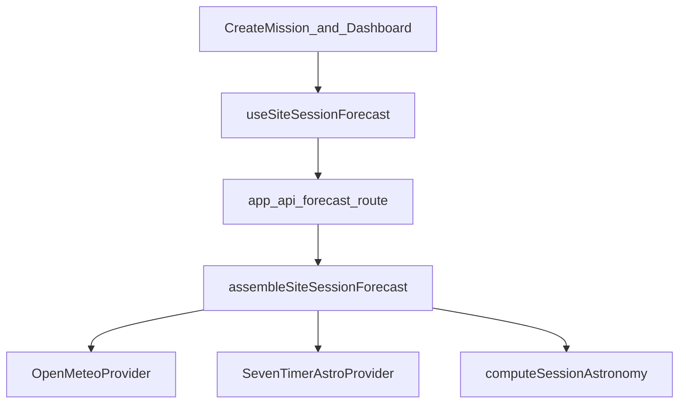

# Forecast Integration Plan

**Status:** Done — implemented and manually accepted (site/date, Create Mission, dashboard, Save Log).  
**Preserve:** deterministic astronomy in `src/lib/sky/visibility.ts` / Generate Plan; Auth → mission → Save Log → Sessions; uncommitted local work.

**Out of scope:** live-session polling, AI explanations, Electron, visual redesign, Setup/Capturing hardcoded condition panels, persisting forecast rows to Supabase.

**Locked defaults:**
- Fetches go through **Next.js Route Handlers** (server), not browser→provider, so CORS and future API keys stay controlled.
- One shared result type **`SiteSessionForecast`** consumed by Create Mission and dashboard Observing Conditions.
- Fake “Forecast confidence %” is **replaced by forecast coverage %** (session hours with data / session hours), never a made-up quality score.
- On outage / out-of-range / partial data: show **Unavailable** (or keep Demo only for fields not yet in scope)—**never invent** numbers.
- Open-Meteo **free** endpoint for now (non-commercial); commercial `customer-api` + key is a later ops decision.
- 7Timer ASTRO for seeing/transparency; if unsuitable before commercial release, swap behind `AstroForecastProvider` without UI rewrites; **no mock numeric fallback**.

---

## 1. Current state (value map)

### Create Mission — Tonight’s Conditions (`app/(app)/missions/new/page.tsx`)

| Display | Today | After Slice 1 | After Slice 2 |
|---------|-------|---------------|---------------|
| Cloud % | Demo `MOCK_CONDITIONS_SOURCE` | Open-Meteo mean over session | same |
| Humidity % | Demo | Open-Meteo | same |
| Wind mph | Demo | Open-Meteo | same |
| Forecast confidence | Demo 78% | **Coverage %** from Open-Meteo hours | same (+ note if astro gap) |
| Moon / dark window | **Calculated** Astronomy Engine | unchanged | unchanged |
| Bortle | **Stored** location | unchanged | unchanged |
| Sky brightness mag/arcsec² | Demo | still Demo (no provider) | still Demo |
| Seeing / Transparency | Demo 1–5 | still Demo labeled | **7Timer** mapped → 1–5 |
| Recommendations blurb | Demo | still Demo | still Demo |

### Dashboard — Observing Conditions Forecast (`DashboardSkyIntelligenceCard.tsx`)

| Display | Today | Target |
|---------|-------|--------|
| Cloud / Humidity / Wind | Mock via `getSkyIntelligenceForSiteDate` (date ignored) | Same `SiteSessionForecast` weather |
| Seeing | Mock | Slice 2 from 7Timer |
| Forecast Confidence | Mock | Coverage % |
| Moon Impact | Mock string | **Astronomy Engine** `moon.interferenceLabel` (not forecast) |
| Live Site tab | Mock / unavailable | untouched |

Dashboard today often resolves coords from `MOCK_LOCATIONS`. Wiring must use the **active Supabase location’s lat/lon** (same as Create Mission).

### Not this phase
SetupView / CapturingView hardcoded “Observing Conditions”, `forecastSeed` overrides, Live Sky telemetry, recommendation AI copy.

Astronomy Engine remains the only source for Moon, darkness, and target windows. Forecast never feeds Generate Plan scores in this phase.

---

## 2. Shared provider boundary

**Modules:**
- `src/lib/forecast/types.ts` — `SiteSessionForecast`, field statuses, provider error kinds
- `src/lib/forecast/openMeteo.ts` — fetch + Zod parse + session aggregation
- `src/lib/forecast/sevenTimer.ts` — ASTRO fetch + map (Slice 2)
- `src/lib/forecast/assemble.ts` — merge weather + astro-forecast + optional astronomy moon label
- `src/lib/forecast/cache.ts` — server TTL cache
- `app/api/forecast/route.ts` — GET `lat`, `lon`, `sessionStart`, `sessionEnd` (ISO)
- `src/lib/forecast/useSiteSessionForecast.ts` — client hook (loading / data / error)

**Input:** `{ latDeg, lonDeg, sessionStart: Date, sessionEnd: Date }`

**Output `SiteSessionForecast`:**
- `weather: { cloudCoverPct, humidityPct, windMph, coveragePct, source: "open-meteo", fetchedAt, validFor: Interval, hourSamples[] } | null`
- `astroWx: { seeingUi1to5, transparencyUi1to5, coveragePct, source: "7timer-astro", fetchedAt, samples[] } | null` (Slice 2)
- `status: { weather: ok | loading | out_of_range | error | unavailable; astroWx: … }`
- `moonInterference` optional from `computeSessionAstronomy` (calculated, not forecast)
- Each numeric field may be `null` with `reason` — UI shows “—” / “Unavailable”, never a guess

**Aggregation:** mean of Open-Meteo hourly points whose timestamp falls in `[sessionStart, sessionEnd]` (same interval Create Mission already resolves, including +24h end roll). Round display integers for % and mph.

**Validation:** Zod on provider JSON before use; reject malformed series; treat Open-Meteo missing arrays and 7Timer `-9999` as null samples.

---

## 3. Slice 1 — Open-Meteo

**API:** `GET https://api.open-meteo.com/v1/forecast`  
**Params:** `latitude`, `longitude`, `hourly=cloud_cover,relative_humidity_2m,wind_speed_10m`, `wind_speed_unit=mph`, `timezone=auto`, `forecast_days` enough to cover session (cap 16).

| Field | Unit | Forecast time | Source |
|-------|------|---------------|--------|
| cloudCoverPct | % | mean of hourly in session | fetched |
| humidityPct | % | mean hourly | fetched |
| windMph | mph | mean hourly | fetched |
| coveragePct | % | count(hours with all three) / session hours | derived |

**Range:** if no hourly timestamps overlap session → `weather: null`, status `out_of_range`.  
**Errors:** network / non-2xx / Zod fail → `error`; UI keeps astronomy; weather slots Unavailable.  
**Attribution (CC BY 4.0):** small “Weather data by Open-Meteo.com” link near conditions (Create Mission + dashboard).  
**Caching:** server key `om:{lat3}:{lon3}:{sessionStartISO}:{sessionEndISO}`; TTL **45 min**; `Cache-Control: private, max-age=1800`. Client refetches when site or session interval changes; no polling timer.  
**Request frequency:** one server fetch per cache miss; UI keyed on committed site/date.

**UI wire:**
1. Create Mission — replace Demo cloud/humidity/wind/confidence with forecast fields + loading/empty; leave seeing/transparency/sky brightness/recommendations Demo.
2. Dashboard Observing Conditions Forecast — same weather + coverage; Moon Impact from astronomy when lat/lon + `dateTime` available; Seeing stays Demo until Slice 2.

**Tests:** fixture JSON → aggregation (overnight, daylight, out-of-range, partial nulls); `npm run typecheck`; `npm run test:visibility` still green; new `npm run test:forecast`.

---

## 4. Slice 2 — 7Timer astronomy forecast

**API:** `GET https://www.7timer.info/bin/api.pl?lon=&lat=&product=astro&output=json`  
**Horizon:** ~3 days from `init` (UTC); `timepoint` = hours after init.

| Raw | Meaning | UI mapping (locked) |
|-----|---------|---------------------|
| seeing 1–8 | 1 best (&lt;0.5″) … 8 worst | `ui = clamp(round(6 - raw*5/7), 1, 5)` so lower raw → higher UI |
| transparency 1–8 | 1 best … 8 worst | same inverse map to 1–5 |
| -9999 | missing | skip sample |

Aggregate mean of mapped samples overlapping session; require ≥1 valid sample else `astroWx: null`.

**Fallback (no invented values):**
- Provider error / timeout / out of range → seeing & transparency **Unavailable** (remove Demo numbers once Slice 2 ships).
- `AstroForecastProvider` interface with `SevenTimerAstroProvider` default; Astrospheric/other can replace before commercial release without changing UI contracts.

**Attribution:** “Astronomy forecast: 7Timer!” link (cite https://www.7timer.info/doc.php).  
**Cache:** separate key `t7:…` TTL 45 min; assemble may return weather ok + astroWx unavailable independently.

**UI:** Create Mission + dashboard Seeing (and Create Mission Transparency) from `astroWx`; labels drop “(Demo)” when status ok.

---

## 5. Separation from Astronomy Engine

| Concern | Owner |
|---------|--------|
| Moon phase, interference, rise/set, dark window, target windows/scores | `computeSessionAstronomy` / `generateDeepSkyPlan` |
| Cloud, humidity, wind, coverage | Open-Meteo |
| Seeing, transparency | 7Timer |
| Bortle | stored location |
| Sky brightness, recommendation blurbs | Demo until a real source exists |

Do not blend weather into mission `score` / altitude / moon scores in this phase.

---

## 6. Caching, failures, UX

- **Stale:** show values + “Updated {relative time}”; if age > 2× TTL, soft “May be stale” but still show last good payload until refresh fails.
- **Loading:** skeleton / “Loading forecast…” on weather chips only; astronomy stays visible.
- **Partial:** Open-Meteo ok + 7Timer fail → weather filled, seeing/transparency Unavailable.
- **No site:** prompt to select location; no fetch.
- **Save Log:** unchanged — does not require forecast success; condition overrides stay local/mission UI.

---

## 7. Pre-existing lint / typecheck (not this phase)

Recorded baseline (do not treat as forecast regressions unless these files are touched):

**Lint:** 32 problems (**7 errors**, 25 warnings), including:
- `src/components/ContextChipsBar.tsx` — setState-in-effect
- `src/components/NightTimeline.tsx` — setState-in-effect
- `src/components/dashboard/LiveSkyCanvas.tsx` — conditional `useMemo`
- `src/components/intelligence/MissionDecisionDrawer.tsx` — unescaped entity
- `src/components/missions/NightSimulationModal.tsx` — use-before-declare
- `src/lib/sky/useSkyModel.ts` — `useMemo` dependency expression

**Typecheck:** `npm run typecheck` currently exits clean in this workspace. Forecast work must keep it clean and must not regress `npm run test:visibility`.

---

## 8. Ordered implementation tasks

1. Write this document. *(done)*
2. **Slice 1 core:** *(done)* `src/lib/forecast/*`, `GET /api/forecast`, `npm run test:forecast`
3. **Slice 1 UI:** *(done)* Create Mission + dashboard Observing Conditions
4. **Verify Slice 1:** automated + manual acceptance — passed
5. **Slice 2 core:** *(done)* 7Timer in same assemble path
6. **Slice 2 UI:** *(done)* seeing/transparency wired; Unavailable on failure
7. **Verify Slice 2:** fixtures + manual — passed

### Implementation map

| Piece | Path |
|-------|------|
| Types | `src/lib/forecast/types.ts` |
| Cache | `src/lib/forecast/cache.ts` |
| Open-Meteo | `src/lib/forecast/openMeteo.ts` |
| 7Timer | `src/lib/forecast/sevenTimer.ts` |
| Assemble | `src/lib/forecast/assemble.ts` |
| Hook | `src/lib/forecast/useSiteSessionForecast.ts` |
| API | `app/api/forecast/route.ts` |
| Tests | `npm run test:forecast` |

**Affected files (implementation):** new `src/lib/forecast/*`, `app/api/forecast/route.ts`, `app/(app)/missions/new/page.tsx`, `src/components/dashboard/DashboardSkyIntelligenceCard.tsx`, `app/(app)/dashboard/page.tsx` (pass real lat/lon), `package.json` script. Avoid unrelated uncommitted files.

---

## 9. Manual acceptance

- Change site → cloud/humidity/wind (and later seeing) update for that lat/lon.
- Change session date/end within range → aggregates move; far-future date → Unavailable / out of range, no fake numbers.
- Create Mission astronomy (Moon/dark) still updates from Engine independently of forecast success.
- Dashboard Observing Conditions Forecast matches Create Mission for same site + overlapping session/night.
- Network failure → weather Unavailable; Save Log → Sessions still succeeds.
- Attribution visible where Open-Meteo / 7Timer data is shown.

---

## 10. Smallest safe first implementation task

**Open-Meteo client + Zod + session aggregation + `/api/forecast` + fixture tests only** (no UI). Then wire Create Mission weather chips in a follow-up commit.

## Decisions (confirmed with plan approval)

1. Free Open-Meteo for development/non-commercial now; commercial key later.
2. Replace fake confidence with **coverage %** (not a proprietary confidence model).
3. 7Timer with **Unavailable** fallback (no mock numbers); swappable provider interface.
4. Server route proxy + 45 min cache.
